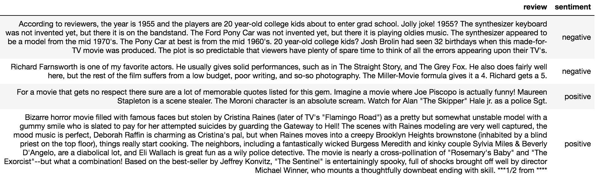
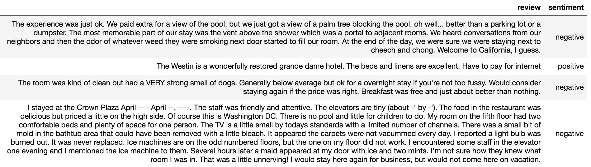

# Title
> summary


# Transfer Learning Using MXNet

{1 sentence about what is transfer learning}. This post provides you an easy to follow tutorial on how to “train a base neural net” on a dataset and use that pre-trained network to “transfer learn” on a different dataset using MXNet/Gluon framework. The high level steps in this tutorial are very similar for any kind of transfer learning problem - tabular, time series, language or computer vision. The major differences when working with different problems are “network architecture” and “transformations and pre-processesing steps”. My goal is to provide a skeletal using text data (movie and hotel reviews) as an example, that you can adapt for different tasks. I have primarily used MXNet, Catboost and Sklearn libraries for this post. {Here} is the link to the jyputer notebook in case you directly want to jump to the code and skip reading the explainations. 

I haven’t covered any theory about what is transfer learning, why and where is it useful. To learn more on the theory part, I recommend this post by *Sebastian Ruder* - [Transfer Learning - Machine Learning's Next Frontier](https://ruder.io/transfer-learning/). Ruder has done his PhD in this topic. So his work is really detailed. Here is the link to his [thesis](https://ruder.io/thesis/) for deep divers. 

The post and notebook combined give you tutorial to the the following things. These topics are also independent tutorials and can be ripped off to use for other problems as well.

1. How to write sklearn transformers? (Provide links that jumps to the topic)
2. How to create a custom neural net architecture on MXNet?
3. How to train a network on MXNet? 
4. How to extract output (a.k.a embeddings) from any layer from the trained model?
5. How to visualize embeddings using TSNE?
6. How to save and load a trained MXNet network
7. How to freeze/unfreeze any layer in MXNet?
8. How to relearn network parameters using a new dataset?  

So let’s dive right in! 


## Data used

I have used [IMDB movie reviews dataset](https://www.kaggle.com/jcblaise/imdb-sentiments#train.csv) to train the base network and transfered the learning done from this base network to [Hotel reviews dataset](https://www.kaggle.com/harmanpreet93/hotelreviews). In general, transfer learning is more useful on smaller or unlabelled data whereas base networks are trained on larger datasets. (Shared links might not be the original source of these datasets. These are just the links I used for my analysis).

Both of these datasets contain reviews and a label about whether the review has a positive or a negative sentiment. (movie reviews from IMDB and hotel reviews from Hotel dataset). Therefore, both of these datasets are similar but from very different domains which makes it a good use case for transfer learning. Let’s see how well we can transfer knowledge from movie reviews to hotel reviews. 

Examples from both datasets
*IMDB *
Total of 25k reviews. 12.5k positive, 12.5k negative


Both of these datasets contain reviews and a label about whether the review has a positive or a negative sentiment. (movie reviews from IMDB and hotel reviews from Hotel dataset). Therefore, both of these datasets are similar but from very different domains which makes it a good use case for transfer learning. Let’s see how well we can transfer knowledge from movie reviews to hotel reviews. 

Examples from both datasets  
#### IMDB
Total of 25k reviews. 12.5k positive, 12.5k negative




#### Hotel
Total of 38.9k reviews. 26.5k positive, 12.4k negative




## Imports

Here, putting a code block of all the libraries that are used for this tutorial. 

```python
# basic utils for data preparation, plotting
import os, sys, time, math, ast, re, string, random
from collections import defaultdict
import datetime
import joblib, boto3
import pandas as pd
import numpy as np
import matplotlib.pyplot as plt
import seaborn as sns
import boto3
import gzip
import tarfile
from io import StringIO

# mxnet/gluon/gluonnlp 
import mxnet as mx
from mxnet import gluon, autograd
import mxnet.ndarray as nd
import gluonnlp as nlp

# sklearn ML stuff
from sklearn.model_selection import train_test_split
from sklearn.metrics import roc_auc_score
from sklearn.feature_extraction.text import TfidfVectorizer
from sklearn.linear_model import LogisticRegression
from sklearn.preprocessing import normalize

# For creating sklearn transformers
from sklearn.pipeline import Pipeline
from sklearn.impute import SimpleImputer
from sklearn.compose import ColumnTransformer
from sklearn.base import BaseEstimator, TransformerMixin
```

## Step 1. Sklearn Data Transformations

The raw data is hardly clean enough to be used directly. There is always some form of data cleaning and pre-processing required to be done on any data before training an ML model. The type and amount of cleaning/pre-processing varies with the data and the choice of ML algorithm. 

This particular task requires minimal data transformations as mentioned below.

1. Replace missing reviews with a token - “null”.
2. Lower case all the text. (Language learning tasks can actually perform better without lower casing. For e.g., “AWESOME” vs “awesome” can show different levels of positive sentiments.)
3. Tokenize the text. Tokenization example: ["the room was kind of clean"] → ["the", "room", "was", "kind", "of", "clean"]. 
4. Assign each token (e.g. “the”, “room”, “was”) an integer index. Our neural net will only takes in numbers, not words and we pass in sequence of numbers to learn the language structure. 

If you have used Sklearn library before, I am sure you would be familiar with `.fit()` and `.transform()` methods. You generally fit an algorithm on training data using `.fit()` method and apply the trained model on the test data using `.transform()` or `.predict()`. You can adapt any transformer or a custom algorithm into this class structure. Just create a custom data transformation pipeline using the same Sklearn interface. It helps you to package your code so that it’s easy to use for both experiements and production, and reproducible for different datasets. *(Link or para on why to use pipelines)*. Below is how a data transformation pipeline looks like 


```python
# Transformers present in Pipeline work in series. 1->2->3->4
transformer_pipe = Pipeline(steps=[
("null_impute", NullImputer(strategy="constant", fill_value="null")),
("lower_case", LowerCaser()),
("tokenize", Tokenize(f"([{string.punctuation}])")),
("token2index", Tok2Idx())
])

X_train_transformed = transformer_pipe.fit_transform(X_train) # fit and transform on train data
X_valid_transformed = transformer_pipe.transform(X_valid)
X_test_transformed = transformer_pipe.transform(X_test)

# saving transformer to a file for later use 
# we need to apply same transformation when we need to ...
# evaluate models on new datasets (batch transform or real time inference)
joblib.dump(transformer_pipe, "filepath")

# loading the saved transformer
transformer_pipe = joblib.load("filepath")

# you can also build a column transformer that applies different pipelines to different 
# set of features and then combine all of the transfromed features together
# e.g.
from sklearn.compose import ColumnTransformer
column_transformer = ColumnTransformer(transformers=[
    ("pipeline1", transformer_pipe1, ["list-of-features1"]),
    ("pipeline2", transformer_pipe2, ["list-of-features2"])
])
```

**Breaking down:** The pipeline above comprises of 4 custom transformers defined using the Sklearn base estimator class. By definition, all steps in a pipeline object run in sequence. i.e. it first fills missing values, then converts strings to lower case, then tokenizes using string punctuations and at the end converts tokens into interger indexes. The input to output map looks like below. 

```python
# After first fitting on the IMDB training data
transformer_pipe.transform(pd.Series(["This is just an example.",
                                      "This is another example"]))
                                

Output:
0    [1192, 40267, 3049, 50090, 51984, 62589]
1    [1192, 40267, 53296, 51984]
```

Let’s look at how each of these transformers are defined. You basically inherit functionalities from Sklearn’s BaseEstimator and TransformerMixin, and overwrite `fit()` and `transform()` methods as per your requirements. 

```python
class Tokenize(BaseEstimator, TransformerMixin):
    """
    Takes in pandas series and applies tokenization on each row based on given split pattern. 
    """
    def __init__(self, split_pat=f"([{string.punctuation}])"):
        self.split_pat = split_pat  # re pattern used to split string to tokens. default splits over any string punctuation
    
    def tokenize(self, s):
        """ Tokenize string """
        re_tok = re.compile(self.split_pat)
        return re_tok.sub(r' \1 ', s).split()  # substitute all delimiters specified in pattern with space and then splits over space
    
    def fit(self, X, y=None):  # no need to learn anything from training data for tokenization. so returning self
        return self

    def transform(self, X, y=None):
        return X.apply(self.tokenize)
    
    
class Tok2Idx(BaseEstimator, TransformerMixin):
    """
    Creates integer index from tokenizes columns. 
    Creates a dictionary of all unique tokens and corresponding integer index
    Transform maps any token unseen in the training data to <unk> token 
    Need pandas series as input. 
    """
            
    def map_tok_idx(self, char):
        try:
            return self.tok2idx[char]
        except KeyError:
            return self.tok2idx["<unk>"]

    def fit(self, X, y=None):
        """ To be called for training data. Creates a token to integer map """
        self.uniq_set = list(set([y for x in list(X.values) for y in x]))
        self.uniq_set.append("<unk>")
        self.tok2idx = {j:i for i,j in enumerate(self.uniq_set)}
        self.idx2tok = {i:j for i,j in enumerate(self.uniq_set)}
        return self

    def transform(self, X, y=None):
        return X.map(lambda x: [self.map_tok_idx(c) for c in x])
    
    
class LowerCaser(BaseEstimator, TransformerMixin):
    """
    Lower case all string values. 
    Need pandas series as input. 
    No fitting is required for this one.
    """
    def transform(self, X, y=None):
        return X.str.lower()
    
    
class NullImputer(SimpleImputer):
    """
    SimpleImputer works with 2D array. For the purpose of this analysis, we are working with pd Series. 
    Modifying it a bit
    """
    def __init__(self, missing_values=np.nan, strategy='mean', fill_value=None, **kw):
        super(NullImputer, self).__init__(
            missing_values=missing_values,
            strategy=strategy,
            fill_value=fill_value
        )

    def fit(self, X, y=None):
        super(NullImputer, self).fit(pd.DataFrame(X), y)
        return self

    def transform(self X):
        result = super(NullImputer, self).transform(pd.DataFrame(X))
        return pd.DataFrame(result)[0]  # converting 2D array back to series
```
